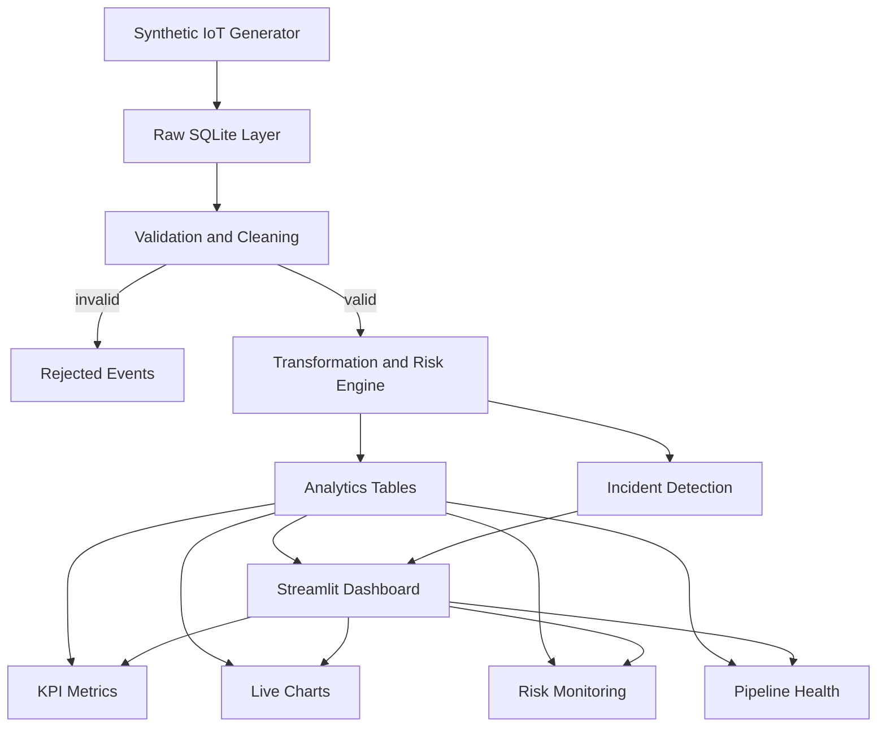

# FrostPulse

A complete end-to-end synthetic cold-chain data engineering and analytics platform, built with Python, SQLite, Streamlit, and Plotly, and packaged for one-click Docker deployment on Hugging Face Spaces.

## Problem

Cold-chain logistics operators need continuous visibility into refrigerated shipment conditions — temperature, humidity, vehicle battery, door status, and location — to prevent spoilage, catch equipment failures early, and quantify shipment risk. FrostPulse simulates this environment end-to-end: it generates realistic telemetry, runs it through a validation and transformation pipeline, scores risk, detects incidents, and surfaces everything on a live analytics dashboard.

## Architecture



## Technology Stack

- **Python 3.11**
- **Streamlit** — dashboard UI and auto-refreshing fragments
- **SQLite** (WAL mode) — single-file embedded database, zero external services
- **Plotly** — line, bar, donut, scatter, area, gauge, radar, heatmap, treemap, Sankey, and geo-bubble visualizations
- **Pandas / NumPy** — data shaping and KPI calculations

No PostgreSQL, MySQL, Kafka, Redis, Airflow, or cloud credentials are required. Everything runs inside a single container.

## Data Pipeline

1. **Generation** (`generator.py`) — produces realistic synthetic sensor events per vehicle/shipment, with roughly 8% of events containing an injected temperature anomaly.
2. **Raw storage** (`database.py`) — every event is written to `raw_sensor_events` unmodified.
3. **Validation** (`pipeline.py`) — checks for null keys, out-of-range temperature/humidity/battery/speed, invalid coordinates, and duplicate event IDs. Failing records are written to `rejected_events` with a reason, never silently dropped.
4. **Transformation and risk scoring** (`pipeline.py`) — computes temperature status (SAFE / WARNING / CRITICAL), a 0–100 risk score from temperature, door status, humidity, battery, and speed, and a corresponding risk level (LOW / MEDIUM / HIGH / CRITICAL).
5. **Incident detection** (`pipeline.py`) — creates incidents for critical temperature breaches, high risk scores, door-open events, and low battery, avoiding duplicates per event/type.
6. **Analytics** (`analytics.py`) — all dashboard queries (KPIs, chart datasets, shipment health, pipeline health, data quality, freshness) live here, separate from UI code.
7. **Dashboard** (`app.py`) — renders everything and re-runs the generation-and-pipeline cycle automatically every 5 seconds via a Streamlit fragment.

## Dashboard Sections

- **Top KPI row** — total shipments, active vehicles, total readings, at-risk shipments, temperature compliance, average risk score.
- **Second KPI row** — critical incidents, warning incidents, average temperature, average humidity, low-battery vehicles, data quality score.
- **Extended operational metrics** — anomaly rate, data quality checks passed, rejected records, top incident type, shipments in transit, highest-risk warehouse, riskiest vehicle, fleet average battery, healthy/at-risk shipment counts, average shipment health score, total incidents logged.
- **Live Temperature Monitoring** — line chart of the most recent readings, colored by status.
- **Temperature Compliance** — donut chart of SAFE / WARNING / CRITICAL readings.
- **Shipment Risk Distribution** — bar chart of shipments by risk level.
- **Risk by Food Category** — average risk score per food category.
- **Vehicle Health** — horizontal bar chart of average risk per vehicle.
- **Supply-Chain Risk Flow** — Sankey diagram of readings flowing from warehouse to food category to risk level.
- **Environmental Telemetry** — humidity-over-time and battery-over-time line charts plus a speed-distribution bar chart.
- **Risk & Compliance Analysis** — risk-score distribution histogram and a temperature-vs-risk scatter.
- **Compliance by Food Category** — horizontal bar of temperature-compliance percentage per food category.
- **Incident Analytics** — incident severity donut, incident-type bar chart, and an incident timeline scatter.
- **Warehouse & Delivery Operations** — average risk by warehouse, delivery-status donut, and rejection-reason bar chart.
- **System Health & Correlations** — composite system-health gauge and a metric correlation heatmap.
- **Fleet Health & Status Trends** — fleet health radar (compliance, risk safety, battery, door discipline) and a stacked-area status-over-time chart.
- **Pipeline Throughput** — generated/processed/rejected/incident counts across recent pipeline runs.
- **Shipment Health** — table of the worst-performing shipments by composite health score.
- **Incident Monitoring** — table of the most recent incidents.
- **Pipeline Health** — records generated/processed/rejected, success rate, recent run history.
- **Data Freshness** — seconds since the last processed event, with a healthy/warning/critical status.

There is no sidebar anywhere in the application; every control and visualization sits on the main page.

## Business Analytics Layer

FrostPulse also ships a second, independent **Business Analytics** dashboard — a Power BI-style executive view built on a synthetic sales dataset (customers, products, orders, revenue, cost, profit). It shares the same SQLite database and the same clean data / calculation / UI separation, but is generated and rendered by its own modules so the cold-chain pipeline is never affected:

- `business_generator.py` — synthetic customers, products, and 24 months of order lines (revenue, cost, gross/net profit, region, channel, category, discounts, dates). Idempotent seeding via `seed_business_data()`.
- `business_analytics.py` — data access (`load_orders` with date / category / region / channel filters) and all 40 KPI calculations as pure pandas functions.
- `business_dashboard.py` — the Power BI-style UI: light professional theme, reusable KPI cards, on-page filters, cross-cutting KPIs, tooltips, an export-to-CSV button, and six pages.

The two dashboards are selected from a single top-level radio (`Operations` / `Business Analytics`) — there is still no sidebar.

### Business dashboard pages (the 40 visualizations)

- **Executive Overview** — Total Revenue, Transactions, Customers, AOV, Gross Profit, Gross/Net Margin %, Revenue/Profit/Customer Growth %, Avg Revenue per Customer, Revenue & Profit trends, Executive Performance Score gauge.
- **Sales Analytics** — Revenue by Month/Quarter/Year, Sales vs Target, Revenue Contribution by Category (treemap), Revenue by Product, Sales by Channel.
- **Customer Analytics** — Customer counts & growth, CLV, Repeat Purchase Rate, Customer Distribution (donut), New vs Returning (stacked), Retention & Churn trends, Top 10 Customers.
- **Product Analytics** — Revenue/Profit by Product, Bottom 10 Products, Category contribution, Discount vs Revenue/Profit, Quantity vs Revenue, Revenue & Profit distributions.
- **Geographic Analytics** — Sales by Region (geo bubble), Revenue by State, Customer concentration.
- **Profitability & Performance** — Gross/Net Profit, margins, Profit vs Target, Channel Profitability, KPI Performance Heatmap, Executive Performance Score.

## Automatic Refresh

The dashboard body is wrapped in a `@st.fragment(run_every=300)` function. Every 5 minutes, only that fragment reruns: it generates 3–8 new synthetic events, pushes them through the pipeline, and re-queries analytics — without a full-page reload and without blocking the Streamlit server.

## SQLite Usage

A single file at `data/frostpulse.db` backs the entire application. WAL journal mode and a 30-second busy timeout allow the concurrent read/write pattern used by Streamlit reruns. Connections are short-lived (opened, used, closed) rather than held globally, and all writes use parameterized queries.

## How This Demonstrates Data Engineering

- A clear multi-stage pipeline: ingestion, raw storage, validation, transformation, aggregation, and serving.
- Explicit data-quality checks with logged pass/fail results per run, not just a "looks fine" dashboard.
- Rejected records are preserved with a reason rather than discarded.
- A dimensional-style schema (`dim_vehicle`, `dim_shipment`, `fact_sensor_reading`, `fact_incident`) alongside operational tables (`pipeline_runs`, `data_quality_results`).
- Indexes on the columns actually used for filtering and ordering in the analytics layer.
- Business logic (risk scoring, incident rules) is centralized and testable, separate from both the UI and the raw ingestion path.

## Run Locally

```bash
pip install -r requirements.txt
streamlit run app.py
```

The app will create `data/frostpulse.db` automatically on first run and seed roughly 700 historical events spanning the last 45 minutes before the dashboard renders.

## Build and Run with Docker

```bash
docker build -t frostpulse .
docker run -p 7860:7860 frostpulse
```

Then open `http://localhost:7860`.

## Deploy to Hugging Face Spaces

1. Create a new Space and select **Docker** as the SDK.
2. Push this project's contents (including the `Dockerfile` and this `README.md` with its metadata block) to the Space repository.
3. Hugging Face builds the Docker image automatically.
4. Streamlit starts and binds to `0.0.0.0:7860` inside the container.
5. On first boot, the app initializes SQLite, seeds historical data, and begins generating new events continuously.
6. No additional configuration, secrets, or manual steps are required.

---

Made by Sourish Dey
FrostPulse — Cold-Chain Intelligence
