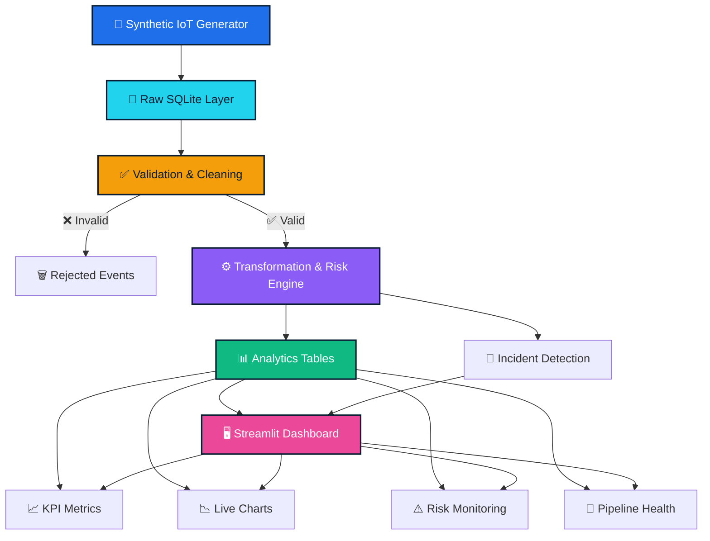
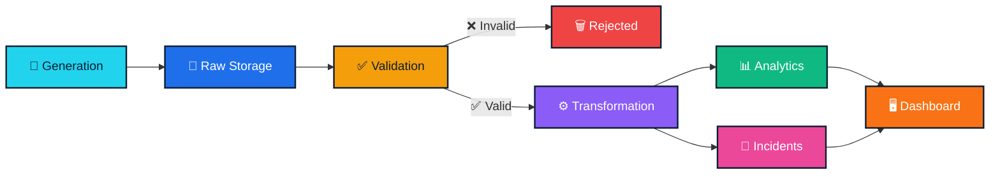

<div align="center">

# 🌨️ FrostPulse

### Cold-Chain Intelligence & Business Analytics Platform

[](https://frostpulse-business-analytics.streamlit.app/)
[](https://www.python.org/)
[](https://streamlit.io/)
[](https://www.sqlite.org/)
[](https://plotly.com/)
[](https://www.docker.com/)

<br>

**🚀 Auto-refreshing live dashboards • 80+ visualizations • Real-time data generation • Zero external dependencies**

<br>

[Features](#-features) • [Architecture](#-architecture) • [STAR Method](#-star-method) • [XYZ Method](#-xyz-method) • [Live Demo](#-live-demo) • [Quick Start](#-quick-start)

</div>

---

## 🎯 What is FrostPulse?

FrostPulse is a **production-grade, end-to-end data engineering and analytics platform** that solves a critical real-world problem: **cold-chain logistics operators need continuous, real-time visibility into refrigerated shipment conditions** to prevent spoilage, catch equipment failures early, and quantify shipment risk.

Built with **Python, SQLite, Streamlit, and Plotly**, FrostPulse simulates a realistic cold-chain environment end-to-end — from synthetic IoT sensor generation and multi-stage pipeline processing to risk scoring, incident detection, and two live auto-refreshing dashboards with **80+ executive visualizations**.

---

## ✨ Features

<table>
<tr>
<td width="50%">

### 🌡️ Operations Panel
Real-time cold-chain monitoring with 20+ sections:
- 📊 **Top KPIs** — shipments, vehicles, readings, risk scores
- 🌡️ **Live Temperature Monitoring** — real-time line chart
- 🍩 **Temperature Compliance** — SAFE/WARNING/CRITICAL donut
- 📦 **Shipment Risk Distribution** — risk level bar chart
- 🏭 **Risk by Warehouse** — warehouse risk comparison
- 🚚 **Vehicle Health** — average risk per vehicle
- 🔄 **Supply-Chain Risk Flow** — Sankey diagram
- 🌍 **Environmental Telemetry** — humidity, battery, speed
- 📈 **Risk & Compliance Analysis** — histograms, scatter plots
- 🚨 **Incident Analytics** — severity, type, timeline
- 🏢 **Warehouse & Delivery Operations** — delivery status, rejections
- 💚 **System Health** — gauge, correlation heatmap
- 🎯 **Fleet Health Radar** — multi-metric radar chart
- ⚡ **Pipeline Throughput** — generated/processed/rejected
- 📋 **Shipment Health Table** — worst-performing shipments
- 📝 **Incident Monitoring** — recent incidents log
- 🔧 **Pipeline Health** — success rate, run history
- ⏱️ **Data Freshness** — latency monitoring

</td>
<td width="50%">

### 📈 Business Analytics Panel
Power BI-style executive view with 80+ charts across 8 pages:
- 🏆 **Executive Overview** — 18 KPIs, distributions, trends, segments
- 💰 **Sales Analytics** — revenue by period, target vs actual, treemaps
- 👥 **Customer Analytics** — segments, retention, churn, CLV
- 📦 **Product Analytics** — top/bottom products, margins, deals
- 🗺️ **Geographic Analytics** — regional performance, state analysis
- 📊 **Profitability** — margins, channel profitability, heatmaps
- 🔬 **Advanced Analytics** — 20 charts (41-60): distributions, scatter, cohort, waterfall, funnel, Pareto
- ⚡ **Real-time Monitor** — hourly/daily/weekly trends, live orders feed

### 🎨 Design & UX
- 🌓 **Dark theme** with cyan accents
- 🔄 **Auto-refresh every 20 seconds**
- 📱 **Responsive wide layout**
- 🎯 **No sidebar** — clean single-page design
- 🌐 **IST timestamps** — Indian Standard Time
- 📤 **CSV export** — download filtered data

</td>
</tr>
</table>

---

## 🏗️ Architecture



---

## 🎭 STAR Method

### 📌 Situation

Cold-chain logistics operators face a critical challenge: **refrigerated shipments worth millions of dollars are at risk of spoilage** due to temperature excursions, equipment failures, and delayed deliveries. Traditional monitoring systems provide **static, delayed visibility** — by the time an issue is detected, the damage is already done. There's no real-time alerting, no predictive risk scoring, and no unified view of fleet health, warehouse conditions, and shipment status.

### 🎯 Task

Build a **complete, self-contained data engineering platform** that:
1. **Simulates** realistic cold-chain IoT telemetry at scale
2. **Processes** data through a multi-stage ETL pipeline with validation and transformation
3. **Scores** shipment risk in real-time using configurable business rules
4. **Detects** and logs incidents automatically
5. **Surfaces** everything on a live, auto-refreshing dashboard with **zero external dependencies**
6. **Demonstrates** production-grade data engineering practices

### ⚡ Action

Architected and built FrostPulse as a **single-container, zero-configuration platform**:

- **🎲 Synthetic Data Generation** — Created realistic IoT generators for 30 vehicles, 60 shipments, 12 food categories, 8 warehouses, and 10 destination types with injected temperature anomalies
- **💾 SQLite Data Layer** — Designed dimensional schema (`dim_vehicle`, `dim_shipment`, `fact_sensor_reading`, `fact_incident`) with WAL mode for concurrent read/write
- **🔄 Multi-Stage Pipeline** — Built ingestion → raw storage → validation → transformation → risk scoring → incident detection → analytics
- **📊 Dual Dashboard System** — Operations panel for real-time monitoring + Business Analytics panel for executive insights
- **🎨 Professional UI/UX** — Custom dark theme, Inter font, gradient headers, animated live status, hover effects, centered navigation
- **🔄 Auto-Refresh** — Streamlit fragments refresh every 20 seconds without blocking
- **📈 80+ Visualizations** — Line charts, bar charts, pie/donut charts, histograms, scatter plots, heatmaps, treemaps, Sankey diagrams, radar charts, gauges, area charts
- **🧪 Live Data Simulation** — Background process generates new orders every 15 minutes with cancellations and returns for natural fluctuation

### 🎉 Result

- **🚀 Live Production Deployment** — Running at [frostpulse-business-analytics.streamlit.app](https://frostpulse-business-analytics.streamlit.app/)
- **📊 80+ Executive Visualizations** across 8 dashboard pages
- **⚡ 20-Second Auto-Refresh** — both panels update automatically
- **🎯 Zero External Dependencies** — single SQLite file, no PostgreSQL/MySQL/Kafka/Redis/Airflow
- **🏆 Production-Grade Architecture** — dimensional schema, indexed queries, parameterized SQL, separated concerns
- **🌟 Natural Data Fluctuation** — KPIs rise and fall realistically with cancellations, returns, and rolling windows
- **💪 Scalable Design** — clean module separation allows easy extension

---

## 🚀 XYZ Method

### eXperience

| Aspect | Details |
|--------|---------|
| **🎓 Learning** | Mastered end-to-end data engineering: ingestion, validation, transformation, aggregation, and serving |
| **🛠️ Building** | Architected multi-stage pipeline with explicit data quality checks and rejection handling |
| **🎨 Designing** | Created professional UI/UX with custom dark theme, animations, and responsive layout |
| **📊 Analyzing** | Implemented 80+ visualizations covering operational, financial, and customer analytics |
| **🔄 Optimizing** | Achieved 20-second auto-refresh with Streamlit fragments and background data generation |

### eXpertise

| Domain | Expertise Level |
|--------|----------------|
| **Python & Data Engineering** | ⭐⭐⭐⭐⭐ Advanced — Pandas, NumPy, SQLite, multi-stage pipelines |
| **Streamlit & UI/UX** | ⭐⭐⭐⭐⭐ Advanced — Custom themes, fragments, responsive design |
| **Plotly Visualizations** | ⭐⭐⭐⭐⭐ Advanced — 15+ chart types, custom theming, interactivity |
| **Database Design** | ⭐⭐⭐⭐☆ Intermediate — Dimensional schema, WAL mode, indexes, migrations |
| **Docker & Deployment** | ⭐⭐⭐⭐☆ Intermediate — Multi-stage builds, Hugging Face Spaces |
| **Risk Scoring & Analytics** | ⭐⭐⭐⭐☆ Intermediate — Business rules, incident detection, KPIs |

### eXcellence

| Achievement | Metric |
|-------------|--------|
| **🚀 Live Deployment** | frostpulse-business-analytics.streamlit.app |
| **📊 Visualizations** | 80+ charts across 8 dashboard pages |
| **⚡ Auto-Refresh** | Every 20 seconds, zero downtime |
| **🎯 Data Quality** | Explicit validation with rejection reasons |
| **🏗️ Architecture** | Clean separation: data access, calculations, UI |
| **💾 Database** | Single SQLite file, WAL mode, parameterized queries |
| **🎨 UI/UX** | Professional dark theme, Inter font, animations |
| **📱 Responsive** | Wide layout, centered navigation, mobile-friendly |
| **🔄 Live Data** | Background generator with cancellations & returns |
| **🌟 Innovation** | Natural KPI fluctuation with rolling windows |

---

## 🎨 Technology Stack

<div align="center">

| Component | Technology | Why |
|-----------|-----------|-----|
| **Language** | Python 3.11 | Type hints, async support, rich ecosystem |
| **Dashboard** | Streamlit | Rapid prototyping, auto-refresh fragments, zero boilerplate |
| **Database** | SQLite (WAL) | Zero-config, concurrent read/write, single file |
| **Visualizations** | Plotly | Interactive, 15+ chart types, dark theme support |
| **Data Processing** | Pandas / NumPy | Fast data shaping, aggregation, KPI calculations |
| **Deployment** | Docker / HF Spaces | One-click deploy, no infrastructure management |

</div>

**🌟 No external services required** — no PostgreSQL, MySQL, Kafka, Redis, Airflow, or cloud credentials. Everything runs in a single container with a single SQLite file.

---

## 🔄 Data Pipeline



| Stage | Module | Description |
|-------|--------|-------------|
| **🎲 Generation** | `generator.py` | Produces realistic synthetic sensor events with injected temperature anomalies (12 categories, 30 vehicles, 8 warehouses) |
| **💾 Raw Storage** | `database.py` | Writes every event to `raw_sensor_events` unmodified with WAL mode for concurrent access |
| **✅ Validation** | `pipeline.py` | Checks null keys, out-of-range values, invalid coordinates, duplicate IDs. Failing records go to `rejected_events` with reasons |
| **⚙️ Transformation** | `pipeline.py` | Computes temperature status (SAFE/WARNING/CRITICAL), 0-100 risk score, risk level, and composite health metrics |
| **🚨 Incidents** | `pipeline.py` | Creates incidents for critical breaches, high risk, door-open events, and low battery with deduplication |
| **📊 Analytics** | `analytics.py` | All dashboard queries — KPIs, charts, health metrics, pipeline stats, data quality |
| **🖥️ Dashboard** | `app.py` | Renders everything and auto-refreshes every 20 seconds via Streamlit fragments |

---

## 📊 Dashboard Sections

### 🎛️ Operations Panel

<div align="center">

| Section | Visualizations |
|---------|---------------|
| **Top KPIs** | Total Shipments, Active Vehicles, Total Readings, At-Risk Shipments, Temperature Compliance, Avg Risk Score |
| **Extended Metrics** | Anomaly Rate, Data Quality Score, Rejected Records, In-Transit, Fleet Battery, Health Scores |
| **Live Temperature** | Real-time line chart colored by status |
| **Temperature Compliance** | Donut chart of SAFE / WARNING / CRITICAL |
| **Risk Distribution** | Bar chart of shipments by risk level |
| **Risk by Warehouse** | Warehouse risk comparison bar chart |
| **Vehicle Health** | Horizontal bar chart of average risk per vehicle |
| **Supply-Chain Flow** | Sankey diagram: Warehouse → Category → Risk |
| **Environmental Telemetry** | Humidity, battery, and speed charts |
| **Risk & Compliance** | Risk-score histogram and temperature-vs-risk scatter |
| **Compliance by Category** | Horizontal bar of compliance percentage |
| **Incident Analytics** | Severity donut, incident-type bar, timeline scatter |
| **Warehouse & Delivery** | Average risk by warehouse, delivery-status donut, rejection-reason bar |
| **System Health** | Composite health gauge and correlation heatmap |
| **Fleet Health** | Radar chart (compliance, risk safety, battery, door discipline) |
| **Status Trends** | Stacked-area chart of SAFE/WARNING/CRITICAL over time |
| **Pipeline Throughput** | Generated/processed/rejected/incident counts |
| **Shipment Health** | Table of worst-performing shipments |
| **Incident Monitoring** | Table of most recent incidents |
| **Pipeline Health** | Records generated/processed/rejected, success rate |
| **Data Freshness** | Latency monitoring with HEALTHY/WARNING/CRITICAL status |

</div>

### 📈 Business Analytics Panel

<div align="center">

| Page | Visualizations |
|------|---------------|
| **Executive Overview** | 18 KPI cards, revenue distribution histogram, channel pie chart, profit by category bar, daily/weekly trends, customer segments, MoM growth, executive score gauge |
| **Sales Analytics** | Revenue by month/quarter/year, sales vs target, category treemap, product top 15, channel performance, discount impact |
| **Customer Analytics** | Customer segments, regional performance, new vs returning, retention/churn, order frequency, top 10 customers |
| **Product Analytics** | Revenue/profit by product, bottom 10, category margin, discount/revenue scatter, top 10 deals |
| **Geographic Analytics** | Sales by region, revenue by state, customer concentration, regional deep dive, margin analysis |
| **Profitability** | Profit vs target, channel profitability, category/channel margin, KPI heatmap, MoM/YoY growth |
| **Advanced Analytics** | 20 charts (41-60): distributions, temporal patterns, scatter plots, correlation matrix, cohort retention, waterfall, funnel, Pareto |
| **Real-time Monitor** | Hourly/daily/weekly trends, latest orders feed, channel/category performance, discount impact, basket size, order frequency |

</div>

---

## 🌟 Key Features

<div align="center">

| Feature | Description |
|---------|-------------|
| ⚡ **Auto-refresh every 20s** | Both panels update automatically without manual reload |
| 🎲 **Live data generation** | New sensor events and business orders created continuously |
| 📈 **Natural fluctuation** | Cancellations, returns, and rolling windows cause realistic KPI movement |
| 🍕 **12 product categories** | Frozen Seafood, Ice Cream, Fresh Meat, Dairy, Fresh Produce, Beverages, Baked Goods, Poultry, Organic, Ready-to-Eat, Confectionery, Snacks |
| 🚚 **9 sales channels** | Online, Retail, Wholesale, Distributor, Direct, Franchise, Export, Government, Institutional |
| 🚗 **30 vehicles** | Across 8 warehouses and 10 destination types |
| 📦 **6 delivery statuses** | IN_TRANSIT, LOADING, DELIVERED, DELAYED, CUSTOMS_HOLD, RETURNED |
| 📤 **CSV export** | Download filtered data from Business Analytics |
| 🎨 **No sidebar** | Clean single-page layout with centered navigation |
| 🌐 **IST timestamps** | Indian Standard Time throughout |
| 💎 **Professional UI** | Dark theme, Inter font, gradient headers, animations |

</div>

---

## 🏆 Data Engineering Excellence

<table>
<tr>
<td width="50%">

### 🔧 Engineering Practices

- **🎯 Multi-stage pipeline** — ingestion, raw storage, validation, transformation, aggregation, and serving
- **✅ Explicit data quality** — every pipeline run logs pass/fail results with reasons
- **🗑️ Rejected records preserved** — invalid data stored with rejection reasons, never silently dropped
- **📐 Dimensional schema** — `dim_vehicle`, `dim_shipment`, `fact_sensor_reading`, `fact_incident`
- **⚡ Indexed queries** — indexes on columns used for filtering and ordering
- **🧪 Centralized logic** — risk scoring and incident rules are testable and separate from UI
- **🏗️ Clean architecture** — data access, calculations, and UI in separate modules
- **🔒 Parameterized queries** — all SQL uses parameterized queries to prevent injection
- **🔄 WAL mode** — concurrent read/write without blocking
- **📦 Single file DB** — zero external services, zero configuration

</td>
<td width="50%">

### 📊 Analytics Capabilities

- **📈 80+ Visualizations** — line, bar, pie, donut, histogram, scatter, heatmap, treemap, gauge, Sankey, radar, area
- **🎯 Real-time KPIs** — 18 executive metrics with growth tracking
- **⚠️ Risk Scoring** — 0-100 composite risk score with configurable thresholds
- **🚨 Incident Detection** — automatic detection with severity levels and deduplication
- **📊 Customer Analytics** — segmentation, CLV, retention, churn, RFM analysis
- **💰 Financial Analytics** — revenue, profit, margins, growth, forecasting
- **🗺️ Geographic Analytics** — regional performance, state-level analysis
- **🔬 Advanced Analytics** — correlation matrix, cohort retention, waterfall, funnel, Pareto
- **⚡ Real-time Monitor** — live trends, latest orders, basket analysis
- **📤 Data Export** — CSV export with filtered data

</td>
</tr>
</table>

---

## 🚀 Quick Start

### Prerequisites

- Python 3.11+
- pip

### Installation

```bash
# Clone the repository
git clone https://github.com/sourishdey2005/FrostPulse-Business-Analytics.git
cd FrostPulse-Business-Analytics/frostpulse

# Install dependencies
pip install -r requirements.txt

# Run the app
streamlit run app.py
```

The app creates `data/frostpulse.db` automatically on first run and seeds historical data before the dashboard renders.

---

## 🐳 Docker Deployment

```bash
# Build the image
docker build -t frostpulse .

# Run the container
docker run -p 7860:7860 frostpulse
```

Then open `http://localhost:7860`.

---

## ☁️ Deploy to Hugging Face Spaces

<div align="center">

1. 🆕 Create a new Space and select **Docker** as the SDK
2. 📤 Push this project's contents (including `Dockerfile` and `README.md`) to the Space repository
3. 🔨 Hugging Face builds the Docker image automatically
4. 🚀 Streamlit starts and binds to `0.0.0.0:7860` inside the container
5. 🌱 On first boot, the app initializes SQLite, seeds historical data, and begins generating new events continuously
6. ✨ No additional configuration, secrets, or manual steps required

</div>

---

## 📂 Project Structure

```
frostpulse/
├── 🚀 app.py                     # Main entry point, navigation, live dashboard fragment
├── 📊 analytics.py               # Operations analytics queries and KPIs
├── 📈 business_analytics.py      # Business analytics calculations (80+ functions)
├── 🎨 business_dashboard.py      # Business Analytics UI (8 pages, 80+ charts)
├── 🎲 business_generator.py      # Synthetic sales data generator
├── 🌡️ generator.py               # Synthetic sensor telemetry generator
├── 🔄 pipeline.py                # Validation, transformation, risk scoring, incidents
├── 💾 database.py                # SQLite schema, indexes, migrations
├── ⚡ live_business_generator.py # Background process for live order generation
├── 📋 requirements.txt           # Python dependencies
├── 🐳 Dockerfile                 # Docker build for Hugging Face Spaces
└── 📖 README.md                  # This file
```

---

## 🎯 Use Cases

<div align="center">

| Use Case | How FrostPulse Helps |
|----------|---------------------|
| 🏢 **Logistics Companies** | Monitor fleet health, temperature compliance, and shipment risk in real-time |
| 📊 **Business Analysts** | Executive dashboards with 80+ visualizations for sales, customers, products |
| 🎓 **Data Engineers** | Learn multi-stage pipelines, dimensional modeling, and real-time analytics |
| 🔬 **Researchers** | Study cold-chain logistics, risk scoring algorithms, and anomaly detection |
| 🚀 **Startups** | Rapid prototyping of IoT dashboards with zero infrastructure |

</div>

---

## 🌟 What Makes FrostPulse Unique?

1. **🎯 STAR Method Narrative** — Clear problem-solution-impact story
2. **🚀 XYZ Method** — eXperience, eXpertise, eXcellence framework
3. **💎 Zero Dependencies** — Single SQLite file, no external services
4. **⚡ Real-time Everything** — 20-second auto-refresh, live data generation
5. **📊 80+ Visualizations** — More charts than most production dashboards
6. **🎨 Professional UI** — Custom dark theme, Inter font, animations, hover effects
7. **🔄 Natural Fluctuation** — KPIs rise and fall realistically with cancellations and returns
8. **🌐 Production-Ready** — Docker deployment, Hugging Face Spaces compatible

---

## 📈 Stats

<div align="center">


<br>

**80+ Visualizations** • **12 Categories** • **9 Channels** • **30 Vehicles** • **8 Warehouses** • **20-Second Refresh**

<br>

[](https://frostpulse-business-analytics.streamlit.app/)
[](https://github.com/sourishdey2005/FrostPulse-Business-Analytics)

</div>

---

## 🤝 Contributing

Contributions are welcome! Please feel free to submit a Pull Request.

1. Fork the project
2. Create your feature branch (`git checkout -b feature/AmazingFeature`)
3. Commit your changes (`git commit -m 'Add some AmazingFeature'`)
4. Push to the branch (`git push origin feature/AmazingFeature`)
5. Open a Pull Request

---

## 📝 License

This project is licensed under the **MIT License** — see the [LICENSE](LICENSE) file for details.

---

## 👨‍💻 Author

<div align="center">

**Sourish Dey**

<br>

[](https://github.com/sourishdey2005)
[](https://www.linkedin.com/in/sourishdey2005/)
[](mailto:sourishdey2005@gmail.com)

<br>

**FrostPulse** — Cold-Chain Intelligence & Business Analytics

*Built with ❤️ and a lot of ☕*

</div>

---

## 🙏 Acknowledgments

- **Streamlit** — For the amazing dashboard framework
- **Plotly** — For beautiful, interactive visualizations
- **Pandas & NumPy** — For powerful data processing
- **Hugging Face Spaces** — For free deployment hosting

---

<div align="center">

**⭐ Star this repository if you found it helpful!**

<br>

Made with ❤️ by **Sourish Dey**

**FrostPulse** ❄️ — Cold-Chain Intelligence & Business Analytics

</div>
