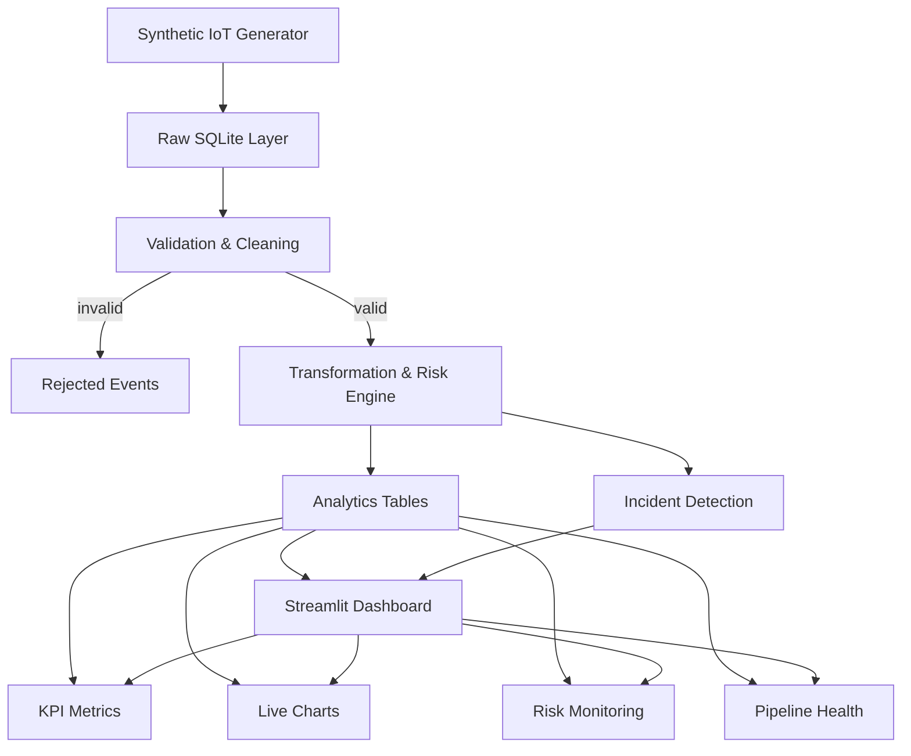

# FrostPulse

**Live Dashboard:** [https://frostpulse-business-analytics.streamlit.app/](https://frostpulse-business-analytics.streamlit.app/)

FrostPulse is an end-to-end synthetic cold-chain data engineering and analytics platform, built with Python, SQLite, Streamlit, and Plotly. It simulates realistic refrigerated shipment telemetry, validates and transforms it through a multi-stage pipeline, scores risk, detects incidents, and surfaces everything on a live auto-refreshing dashboard — alongside a full Business Analytics layer with 80+ executive visualizations.

---

## What It Does

FrostPulse solves a real operational problem: cold-chain logistics operators need continuous visibility into shipment conditions — temperature, humidity, vehicle battery, door status, and location — to prevent spoilage, catch equipment failures early, and quantify shipment risk.

The platform simulates this environment end-to-end:
1. **Generates** realistic synthetic sensor telemetry with injected anomalies
2. **Stores** raw events in SQLite (WAL mode) for concurrent read/write
3. **Validates** every record with explicit quality checks and rejection reasons
4. **Transforms** data with risk scoring, incident detection, and aggregation
5. **Serves** two live dashboards that auto-refresh and pick up new data automatically

---

## Architecture



---

## Technology Stack

| Component | Technology |
|-----------|-----------|
| Language | Python 3.11 |
| Dashboard | Streamlit (auto-refreshing fragments) |
| Database | SQLite (WAL mode, parameterized queries) |
| Visualizations | Plotly (line, bar, pie, histogram, scatter, heatmap, treemap, gauge, Sankey, geo) |
| Data Processing | Pandas / NumPy |
| Deployment | Docker / Hugging Face Spaces |

**No external services required** — no PostgreSQL, MySQL, Kafka, Redis, Airflow, or cloud credentials. Everything runs in a single container with a single SQLite file.

---

## Data Pipeline

| Stage | Module | Description |
|-------|--------|-------------|
| **Generation** | `generator.py` | Produces realistic synthetic sensor events per vehicle/shipment with injected temperature anomalies |
| **Raw Storage** | `database.py` | Writes every event to `raw_sensor_events` unmodified |
| **Validation** | `pipeline.py` | Checks null keys, out-of-range values, invalid coordinates, duplicate IDs. Failing records go to `rejected_events` with a reason |
| **Transformation** | `pipeline.py` | Computes temperature status, 0–100 risk score, risk level, and composite health metrics |
| **Incident Detection** | `pipeline.py` | Creates incidents for critical breaches, high risk, door-open events, and low battery |
| **Analytics** | `analytics.py` | All dashboard queries (KPIs, charts, health metrics, pipeline stats) |
| **Dashboard** | `app.py` | Renders everything and auto-refreshes every 20 seconds |

---

## Dashboard Sections

### Operations Panel
Real-time cold-chain monitoring with 20+ sections:

- **Top KPIs** — total shipments, active vehicles, total readings, at-risk shipments, temperature compliance, average risk score
- **Extended Metrics** — anomaly rate, data quality score, rejected records, shipments in transit, fleet battery, health scores
- **Live Temperature Monitoring** — real-time line chart colored by status
- **Temperature Compliance** — donut chart of SAFE / WARNING / CRITICAL readings
- **Shipment Risk Distribution** — bar chart of shipments by risk level
- **Risk by Food Category** — average risk score per category
- **Vehicle Health** — horizontal bar chart of average risk per vehicle
- **Supply-Chain Risk Flow** — Sankey diagram of readings flowing from warehouse to category to risk level
- **Environmental Telemetry** — humidity, battery, and speed charts
- **Risk & Compliance Analysis** — risk-score histogram and temperature-vs-risk scatter
- **Compliance by Food Category** — horizontal bar of compliance percentage per category
- **Incident Analytics** — severity donut, incident-type bar, timeline scatter
- **Warehouse & Delivery Operations** — average risk by warehouse, delivery-status donut, rejection-reason bar
- **System Health & Correlations** — composite health gauge and correlation heatmap
- **Fleet Health & Status Trends** — radar chart and stacked-area status chart
- **Pipeline Throughput** — generated/processed/rejected counts across recent runs
- **Shipment Health** — table of worst-performing shipments
- **Incident Monitoring** — table of most recent incidents
- **Pipeline Health** — records generated/processed/rejected, success rate, run history
- **Data Freshness** — seconds since last processed event with health status

### Business Analytics Panel
Power BI-style executive view with 80+ visualizations across 8 pages:

- **Executive Overview** — 18 KPI cards, revenue distribution histogram, channel revenue pie chart, profit by category bar chart, daily/weekly trends, customer segments, MoM growth, executive score gauge
- **Sales Analytics** — revenue by month/quarter/year, sales vs target, category treemap, product top 15, channel performance, discount impact analysis
- **Customer Analytics** — customer segments, regional performance, new vs returning, retention/churn, order frequency, top 10 customers
- **Product Analytics** — revenue/profit by product, bottom 10, category margin, discount/revenue scatter, top 10 deals
- **Geographic Analytics** — sales by region, revenue by state, customer concentration, regional deep dive, margin analysis
- **Profitability & Performance** — profit vs target, channel profitability, category/channel margin, KPI heatmap, MoM/YoY growth, executive score
- **Advanced Analytics** — 20 charts (41–60): distributions, temporal patterns, scatter plots, correlation matrix, cohort retention, waterfall, funnel, Pareto
- **Real-time Monitor** — hourly/daily/weekly trends, latest orders feed, channel/category performance, discount impact, basket size, order frequency

---

## Live Demo

**Operations & Business Analytics Dashboard:**  
[https://frostpulse-business-analytics.streamlit.app/](https://frostpulse-business-analytics.streamlit.app/)

---

## Key Features

- **Auto-refresh every 20 seconds** — both panels update automatically without manual reload
- **Live data generation** — new sensor events and business orders created continuously
- **Natural data fluctuation** — cancellations, returns, and rolling time windows cause KPIs to rise and fall realistically
- **12 product categories** — Frozen Seafood, Ice Cream, Fresh Meat, Dairy, Fresh Produce, Beverages, Baked Goods, Poultry, Organic, Ready-to-Eat, Confectionery, Snacks
- **9 sales channels** — Online, Retail, Wholesale, Distributor, Direct, Franchise, Export, Government, Institutional
- **30 vehicles** across 8 warehouses and 10 destination types
- **6 delivery statuses** — IN_TRANSIT, LOADING, DELIVERED, DELAYED, CUSTOMS_HOLD, RETURNED
- **Data export** — CSV export of filtered data from Business Analytics
- **No sidebar** — clean single-page layout with top-level navigation

---

## How This Demonstrates Data Engineering

- **Multi-stage pipeline** — ingestion, raw storage, validation, transformation, aggregation, and serving
- **Explicit data quality** — every pipeline run logs pass/fail results with reasons, not just "looks fine"
- **Rejected records preserved** — invalid data is stored with rejection reasons, never silently dropped
- **Dimensional schema** — `dim_vehicle`, `dim_shipment`, `fact_sensor_reading`, `fact_incident` alongside operational tables
- **Indexed queries** — indexes on columns actually used for filtering and ordering in analytics
- **Centralized business logic** — risk scoring and incident rules are testable and separate from UI/ingestion
- **Clean architecture** — data access, calculations, and UI are in separate modules

---

## Run Locally

```bash
# Clone the repository
git clone https://github.com/sourishdey2005/FrostPulse-Business-Analytics.git
cd FrostPulse-Business-Analytics

# Install dependencies
pip install -r requirements.txt

# Run the app
streamlit run app.py
```

The app creates `data/frostpulse.db` automatically on first run and seeds historical data before the dashboard renders.

---

## Build and Run with Docker

```bash
docker build -t frostpulse .
docker run -p 7860:7860 frostpulse
```

Then open `http://localhost:7860`.

---

## Deploy to Hugging Face Spaces

1. Create a new Space and select **Docker** as the SDK
2. Push this project's contents (including `Dockerfile` and `README.md`) to the Space repository
3. Hugging Face builds the Docker image automatically
4. Streamlit starts and binds to `0.0.0.0:7860` inside the container
5. On first boot, the app initializes SQLite, seeds historical data, and begins generating new events continuously
6. No additional configuration, secrets, or manual steps required

---

## Project Structure

```
frostpulse/
├── app.py                     # Main entry point, navigation, live dashboard fragment
├── analytics.py               # Operations analytics queries and KPIs
├── business_analytics.py      # Business analytics calculations (80+ functions)
├── business_dashboard.py      # Business Analytics UI (8 pages, 80+ charts)
├── business_generator.py      # Synthetic sales data generator
├── generator.py               # Synthetic sensor telemetry generator
├── pipeline.py                # Validation, transformation, risk scoring, incidents
├── database.py                # SQLite schema, indexes, migrations
├── live_business_generator.py # Background process for live order generation
├── requirements.txt           # Python dependencies
├── Dockerfile                 # Docker build for Hugging Face Spaces
└── README.md                  # This file
```

---

## License

MIT

---

Made by Sourish Dey  
**FrostPulse — Cold-Chain Intelligence & Business Analytics**
